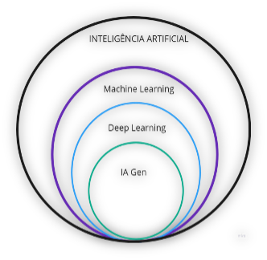

# IA Generativa na Promotoria
## Aprendizados, Limitações e o que Funciona Agora

**José Eduardo de Souza Pimentel**
ESMP - maio de 2025 (v. 2.0)

---

# Agenda de 08/05/2025 (1º dia)
- O que é IA Generativa?
- Posso usar a IA generativa na Promotoria?
- Como um modelo de linguagem pode me ajudar?
- Privacidade e “alucinações”
- Escolhendo o provedor/modelo
- Engenharia de prompt
- **Início do "Mão na massa”**
- Desafio

---

# Questões administrativas
- Baixe a apostila e os slides do curso em:
https://jespimentel.github.io/ia_gen_na_promotoria/

---

# Cadastre-se:
- ChatGPT: https://chatgpt.com/
- Gemini: https://gemini.google.com/
	- Conta do Google/Gmail
	- Confira o mês grátis
- Perplexity: https://www.perplexity.ai/ 
	- Verifique resgate de benefício Vivo

---

# O que é IA Generativa?
* Os modelos aprendem como as informações se organizam e estão estatisticamente distribuídas no _corpus_ de treinamento.
* LLMs: geram textos coerentes e relevantes em resposta aos comandos dos usuários (_prompts_).
* Não possuem conhecimentos factuais. 

---

# Posso usar a IA generativa na Promotoria?
- Sim.
- PCA nº 0000416-89.2023.2.00.0000 (j. 21/06/2024)
- Resolução nº 332/2020 (atualiz. em 18/02/2025)
	- assinatura ou cadastro privado (se não tiver solução corporativa)
	- neste caso, proibido em dados sigilosos ou protegidos por segredo de justiça
- Crítica: solução de produtividade pessoal

---

# Como um modelo de linguagem pode me ajudar?
- Processar e analisar grandes volumes de texto
- Resumir autos judiciais e documentos complexos
- Auxiliar na pesquisa doutrinária e jurisprudencial
- Gerar minutas de peças processuais
- Etc, etc, etc...

**Consequência:**
- Libera tempo de membros e servidores da Instituição.

**Aplicação**
- Tarefas de menor complexidade

---

# Privacidade e “alucinações”
- Conhecer termos de uso e opções _opt-in_ ou _opt-out_ dos provedores
- **Alucinação:** 
	- modelos não possuem compreensão real dos assuntos
	- geram respostas com base em padrões probabilísticos aprendidos durante o treinamento
	- não verificam a veracidade ou a completude das informações
- **Devemos:**
	- Verificar as informações
	- Não utilizar como única fonte de pesquisa
	- Estar cientes das limitações da tecnologia

---

# Escolhendo o provedor/modelo

| Modelo             | Diferenciais                                                                 |
|--------------------|------------------------------------------------------------------------------|
| ChatGPT            | - Janela de contexto de 128K tokens - Multimodal - Recursos avançados - Criação dos “Meus GPTs” - Versões gratuita/paga (US$ 20/mês) |
| Claude             | - Janela de contexto de aproximadamente 200K tokens - Multimodal - Artefatos - Projetos - Versões gratuita/paga (US$ 20/mês) |

---

| Modelo             | Diferenciais                                                                 |
|--------------------|------------------------------------------------------------------------------|
| Gemini             | - Janela de contexto de 1M tokens - Multimodal - Integração com o Google Workspace/One AI Premium - Criação de “Gems” - Versões gratuita/paga (US$ 19.99/mês) |
| Google AI Studio   | - Plataforma de experimentação e desenvolvimento - Maior controle do usuário - Interação multimodal - Visão computacional em tempo real - Versões gratuita/paga (US$ 0.0015/1k tokens) |

---

| Modelo             | Diferenciais                                                                 |
|--------------------|------------------------------------------------------------------------------|
| Grok               | - Janela de contexto de 1M tokens - Multimodal - DeepSearch abrangente dos posts do X - ThinkMode mais transparente para a resolução de dilemas éticos - Tom humorístico, sarcástico e “anti-woke” - Versões gratuita/paga (US$ 40/mês) |
| Microsoft Copilot  | - Melhor em termos de privacidade (sistema Enterprise Data Protection) - Integração com o Microsoft 365 - Licenciamento corporativo |

---

| Modelo             | Diferenciais                                                                 |
|--------------------|------------------------------------------------------------------------------|
| NotebookLM         | - Fontes do usuário (menos alucinação): aceita arquivos dos tipos pdf, txt, md, 3g2, 3gp, aac, aif, aifc, aiff, amr, au, avi, cda, m4a, mid, mp3, mp4, mpeg, ogg, opus, ra, ram, snd, wav e wma - Resumos, linha do tempo, mapas mentais e podcasts - Grounding com citações - Versões gratuita/paga (disponível com a assinatura do One AI Premium) |
| Perplexity         | - Ideal para pesquisas - Citações com links diretos - Busca em tempo real - Aceita upload de arquivos - Versões gratuita/paga (1 ano grátis para clientes Vivo) |

---

# Engenharia de prompt
- **Contexto**: fornece informações de fundo ou situacionais que ajudam o modelo a entender melhor o cenário e a aplicar corretamente as instruções.
- **Instruções**: define as tarefas que o modelo deve executar (exemplos: "analise", "compare", "liste", "reescreva", “resuma de forma estruturada”). 
- **Dados de entrada**: consistem no material específico sobre o qual a instrução deve operar (exemplo: texto legal, peças de um inquérito civil, um acórdão)
- **Tipo de saída esperada**: orienta o modelo sobre a forma de apresentar a resposta (exemplos: "em formato de tabela", "como uma lista de pontos (bullet points)", "em linguagem formal", "com no máximo 2 parágrafos", "na forma do template fornecido"). 

---

# Engenharia de prompt (dicas gerais)
- Comece simples
- Dê um papel à LLM
- Adicione contexto relevante
- Divida tarefas complexas
- Use instruções claras e diretas
- Seja específico e forneça exemplos
- Diga o que não fazer
- Dê feedbacks ao modelo
- Utilize tags ou Markdown

---

# Engenharia de prompt (técnicas avançadas)
- Zero shot
- Poucos exemplos (Few-Shot Prompting)
- Cadeia de pensamento (Chain-of-Thought - CoT)
- Encadeamento de prompts

Observações:
- Diferentes modelos fornecem diferentes respostas
- Consciência das limitações

---

# Engenharia de prompt (conceitos importantes)
- System Instructions
- Tokens
- Janela de contexto
- Temperatura
- Grounding
- Placeholders e templates dinâmicos
- Playgrounds
- Instruções especiais

---

# Markdown
| Marcação        | Descrição no Prompt                                                                    | Exemplo no Prompt           |
|-----------------|----------------------------------------------------------------------------------------|-----------------------------|
| `# Título`      | Define um título principal, ajudando a destacar o tema geral do prompt.               | `# Analisador de IP`        |
| `## Subtítulo`  | Define subtítulos, organizando o prompt em seções lógicas.                             | `## Instruções Detalhadas`  |
| `**Negrito**`   | Destaca palavras ou frases importantes, chamando a atenção do LLM para termos-chave.   | `**Não inclua opiniões**`   |

---

# Markdown (cont.)

| Marcação        | Descrição no Prompt                                                                    | Exemplo no Prompt           |
|-----------------|----------------------------------------------------------------------------------------|-----------------------------|
| `* Item da lista` | Outra forma comum de criar listas não ordenadas.                                      | `* Verifique gramática e ortografia.` |
| `1. Item da lista`| Cria listas ordenadas, importantes quando a ordem dos itens é relevante.            | `1. Identifique as contradições.` |
| `>`             | Cria um bloco de citação para destacar instruções específicas ou fornecer exemplos. | `> Siga este formato:`      |

---

# Markdown (cont.)

| Marcação        | Descrição no Prompt                                                                    | Exemplo no Prompt           |
|-----------------|----------------------------------------------------------------------------------------|-----------------------------|
| `---`           | Cria uma linha horizontal para separar diferentes seções do prompt, melhorando a legibilidade. | `---`

---

# Incorporando a IA ao fluxo de trabalho
## 1. CONTEXTO
* **Papel do Modelo:** Você é um promotor de justiça.
* **Objetivo:** {{Informe o objetivo do prompt}}
* **Histórico:** {{Descreva o histórico do caso, se aplicável}}
* **Fontes de Informação:** {{Especifique as fontes primárias, como documentos ou referências}}

---

# Continuação do framework ...
## 2. INSTRUÇÕES DETALHADAS
1.  {{Primeira instrução}}
2.  {{Segunda instrução }}
	* {{Subinstrução, se necessário}}
3.  {{Terceira instrução}}
	* {{Subinstrução, se necessário}}

---

# Continuação do framework ...
## 3. DADOS DE ENTRADA
* **Do que tratam os dados de entrada?:** {{Informe do que tratam os dados, ex.: inquérito policial, depoimentos, certidões}}
* **Formato dos Dados:** {{Especificar se são textos, tabelas, imagens ou outros}}
* **Observações Adicionais:** {{Incluir informações complementares, se necessário}}

---

# Continuação do framework ...
## 4. FORMATO DE SAÍDA ESPERADO
* **Estrutura:** {{Como a saída deve ser estruturada? (Ex.: seção para data/hora, local, identificação de envolvidos, análise do laudo, classificação jurídica do fato etc)}}
* **Linguagem:** Use o Português (BR).
* **Tom:** Formal e objetivo.
* **Tamanho do texto:** {{Indique o tamanho do texto esperado (Ex.: 4 parágrafos}}

---

# Continuação do framework ...
## 5. RESTRIÇÕES
* {{Indique suas restrições}} 
* Confira todas as informações antes de apresentar a resposta.
* Não invente nada. Se não souber responder a algum dos itens, diga “não sei”.
* Não use as informações fornecidas como exemplos para a resposta (se aplicável).
* Não use informações externas sem confirmação e, se necessário, referencie adequadamente.
* Caso haja divergências ou incertezas nos dados, registre as limitações da análise.

---

# Configurações e exemplos
* Cadastramento
* Configurando a privacidade
* Configurando as instruções especiais
* Habilitando funcionalidades
* **Casos de uso**

---

# Agenda de 15/05/2025 (2º encontro)
- Desafio: discussão dos resultados
- Revisando configurações
- **Mais “mão na massa”**
- Reaproveitamento e compartilhamento de prompts
- Usos mais avançados
- Por onde seguir?

---

# Questões administrativas
- Apostila, slides (**atualizados**), errata e atualizações:
https://jespimentel.github.io/ia_gen_na_promotoria/

---

# Revisando configurações
* Privacidade
* Instruções personalizadas
* Funcionalidades habilitadas

---

# Mais casos de uso
* Resumos, peças, diarização,manipulação de arquivos, etc.
* Criação de Gems
* Criação de GPTs
* Mapas mentais, podcasts, linha do tempo, "visual law", etc.

---

# Reaproveitamento e compartilhamento de prompts
* Opções (planilhas, arquivos texto, Obsidian, GitHub, OneNote)
* Visão geral do Google Keep (adotado por mim)

---

# Usos mais avançados
* Interpretador de código nativo
* APIs e tarefas em lote
* RAG
* Agentes de IA
* Enxame de agentes

---

# Por onde seguir?
* A importância da experimentação
* Python e Google Colab
* Atenção à regulamentação

---

# Obrigado!

linkedin.com/in/jespimentel
jespimentel.blogspot.com
github.com/jespimentel

pimentel@mpsp.mp.br